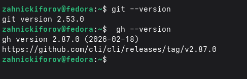
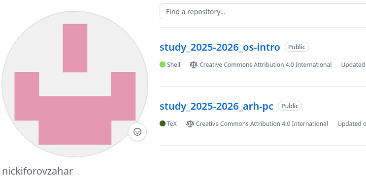

---
## Author
author:
  name: Никифоров Захар Сергеевич
  email: 1032253520@rudn.ru
  affiliation:
    - name: Российский университет дружбы народов
      country: Российская Федерация
      postal-code: 117198
      city: Москва
      address: ул. Миклухо-Маклая, д. 6
## Title
title: Система контроля версий Git
subtitle: Лабораторная работа №2
license: CC BY
date: today
date-format: "YYYY-MM-DD" # Example: 2025-09-06
---

# Вводная часть

## Актуальность

- Система контроля версий необходима для совместной работы над проектами.
- Git --- наиболее распространенная система
- Умение работать с Git и GitHub обязательно для современного разработчика

## Объект и предмет исследования

- Объект исследования: система контроля версий Git.
- Предмет исследования: настройка Git, создание ключей GPG и SSH, работа с GitHub.

## Цели и задачи

Цель: Изучить идеологию и применение средств контроля версий. Освоить умения по работе с git.

Задачи: 
1. Создать базовую конфигурацию для работы с системой.
2. Создать ключи GPG и SSH.
3. Настройка подписей Git.
4. Создать репозиторий курса на основе шаблона.

## Материалы и методы

- Оборудование: ПК с ОС на базе Linux или ВМ на нем с такой системой
- ПО: Git, GitHub CLI, OpenSSH, GnuPG 
- Методы: Установка согласно руководству, настройка через терминал, создание ключей, работа с удаленным репозиторием.

# Выполнение лабораторной работы

## Установление программного обеспечения

- Установлены git и gh.

{#fig-001 width=70%}

## Базовая настройка git

- Задаем имя и электронную почту пользователя
- Задаем начальные настройки ветки и ее саму.

{#fig-002 width=70%}

## Создание ключей SSH и GPG

- Создаем SSH и GPG ключи
- Добавляем их в свой профиль на GitHub.

{#fig-003 width=70%}

{#fig-004 width=70%}

## Настройка автоматических подписей коммитов git

- Настраиваем автоматическую подпись коммитов с помощью нового ключа.

{#fig-005 width=70%}

## Создание репозитория курса на основе шаблона

- Создаем репозиторий курсана основе шаблона для студентво
- Проверяем корректность сборки на GitHub.

{#fig-006 width=70%}

# Выводы

- Была изучена идеология и применение средств контроля версий. 
- Освоены умения по работе с git.
