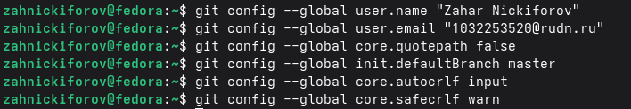
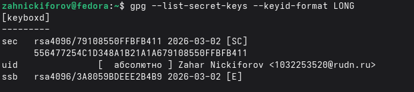
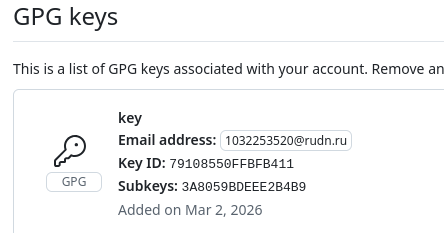
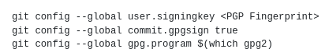
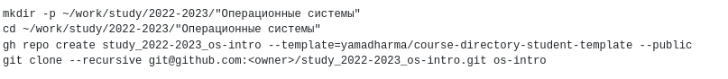
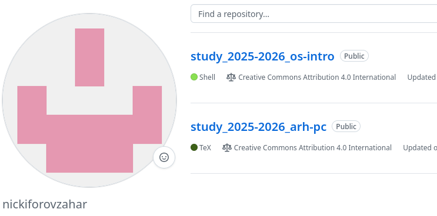

---
author:
  name: Никифоров Захар Сергеевич
  group: НКАбд-05-25
  student-id: 1032253520
title: "Отчет по лабораторной работе №2"
subtitle: "Архитектура компьютера"
license: "CC BY"
---

# **Цель работы**

Изучить идеологию и применение средств контроля версий. Освоить умения по работе с git.
# **Порядок выполнения работы**
## **Установление программного обеспечения**

Скачиваем *git* и *gh*, если они не установлены, а иначе --- просто проверяем их версии.

{#fig-001 width=70%}

## **Базовая настройка git**

Задаем имя и электронную почту пользователя, настраиваем вывод сообщений в UTF-8, задаем начальную ветку и параметры autocrlf и safecrlf. 

{#fig-002 width=70%}

## **Создание ключей ssh и pgp**

Генерируем ключ ssh размером 4096 бит и по алгоритму ed25519, потом pgp ключ. Выбираем следующие опции: RSA and RSA; 4096 размер; срок действия неограничен. Вводим свои данные.
Выводим список ключей и вставляем их в свой профиль на GitHub.

{#fig-003 width=70%}

{#fig-004 width=70%}

## **Настройка автоматических подписей коммитов git**

Используя введёный email, указываем Git применять его при подписи коммитов, используем следующие команды и вводим свой отпечаток ключа:

{#fig-005 width=70%}

## **Настройка gh**

Авторизуемся с помощью команды *gh auth login*, заходим в браузер под своим профилем.

## **Создание репозитория курса на основе шаблона**
Заменяя *2022-2023* на текущий учебный год, используем следующие команды:

{#fig-006 width=70%}

Как итог получаем репозиторий для работы на нашем курсе.

{#fig-007 width=70%}

# **Контрольные вопросы**

1.Что такое системы контроля версий (VCS) и для решения каких задач они предназначаются?

Это система предназначенная для хранения истории изменения файлов проекта и совместной над ними работы.

2.Объясните следующие понятия VCS и их отношения: хранилище, commit, история, рабочая копия.

Хранилище --- база данных проекта, commit --- фиксация изменений, история --- последовательность коммитов, рабочая копия --- текущие файлы пользователя.

3.Что представляют собой и чем отличаются централизованные и децентрализованные VCS? Приведите примеры VCS каждого вида.

Централизированные --- один сервер(CSV, SVN), распределенные --- локальные сервера у каждого(Git, Mercurial)

4.Опишите действия с VCS при единоличной работе с хранилищем.

Изменение $\rightarrow$ add $\rightarrow$ commit $\rightarrow$ push 

5.Опишите порядок работы с общим хранилищем VCS.

Редактирование $\rightarrow$ добавление $\rightarrow$ фиксация $\rightarrow$ синхронизация

6.Каковы основные задачи, решаемые инструментальным средством git?

Хранение истории, ветвление, объединение, синхронизация, контроль целостности.

7.Назовите и дайте краткую характеристику командам git.

git: init --- создание репозитория, add --- добавление в индекс, commit --- фиксация, push --- отправка, pull --- получение, branch --- работа с ветками, merge --- объединение. 

8.Приведите примеры использования при работе с локальным и удалённым репозиториями.

Локально: *git init* $\rightarrow$ *git add .* $\rightarrow$ *git commit -m "msg"*

Удаленно: *git push origin master* $\rightarrow$ *git pull origin master*

9.Что такое и зачем могут быть нужны ветви (branches)?

Это отдельная линия разработки, которая независима от других. Нужно это, чтобы не ломать код, работать в команде, тестировать идеи.

10.Как и зачем можно игнорировать некоторые файлы при commit?

Чтобы не добавлять временные, служебные и бинарные файлы.

# **Выводы**

Была изучена идеология и применение средств контроля версий. Освоены умения по работе с git.

::: {#refs}
:::
