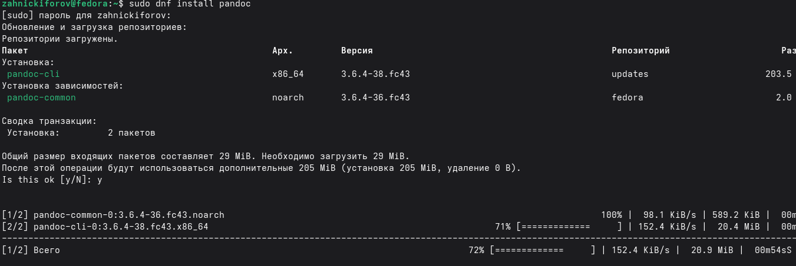
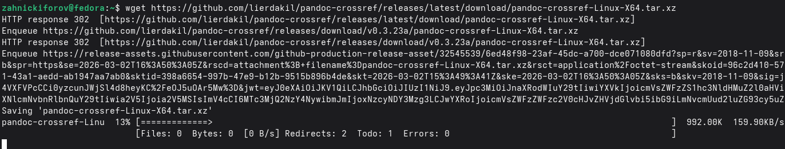
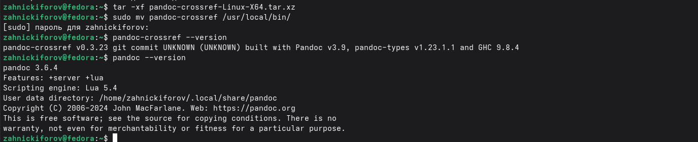
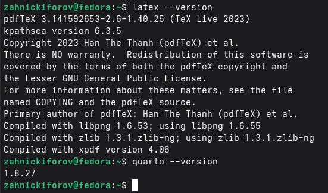
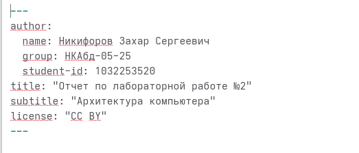
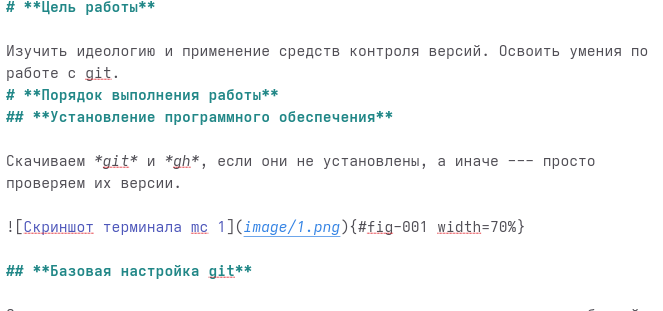
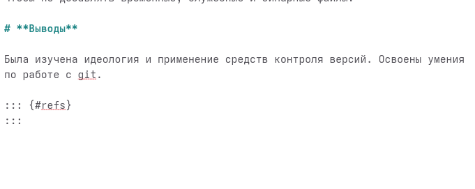
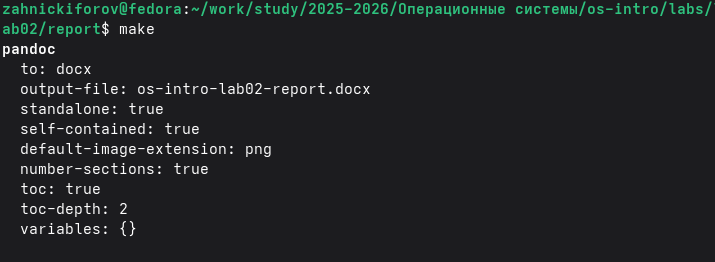
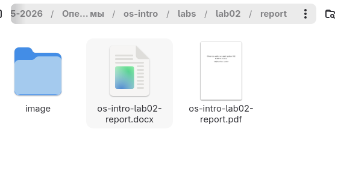

---
author:
  name: Никифоров Захар Сергеевич
  group: НКАбд-05-25
  student-id: 1032253520
title: "Отчет по лабораторной работе №3"
subtitle: "Архитектура компьютера"
license: "CC BY"
---

# **Цель работы**

Научиться оформлять отчёты с помощью легковесного языка разметки Markdown.

# **Порядок выполнения работы**
## **Установка программ для создания отчетов**

Чтобы можно было компилировать отчёты корректно мы устанавливаем *pandoc* и *pandoc-crossref*, также проверяем наличие *LaTeX* и *quarto*, так как они тоже пригодятся.

{#fig-001 width=70%}

{#fig-002 width=70%}

{#fig-003 width=70%}

{#fig-004 width=70%}

Установка прошла успешно, наличие программ проверено.

## **Написание отчёта по прошлой лабораторной**

Предварительно собрав скриншоты, переходим в каталог курса с соответствующей лабораторной, находим каталог *report*, а в нем файл с расширение *.qmd*. Открываем для редактирования и оформляем титульный лист.

{#fig-005 width=70%}

Завершив с оформлением титульного листа начинаем заполнять сам отчёт.

{#fig-005 width=70%}

{#fig-007 width=70%}

Закончив с написанием, переходим в наш каталог через консоль, проверяем наличие скриншотов в каталоге *image* и прописываем *make*.

{#fig-008 width=70%}

По завершении открываем новый каталог *output* на наличие нужных нам документов в формате .docx и .pdf

{#fig-008 width=70%}

Файлы скомпилировались, успех. Сохраним и закомментируем изменения в репозитории и отправим их на GitHub.

# **Выводы**

Были освоен легковесный язык разметки Markdown

::: {#refs}
:::
