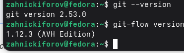
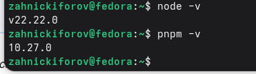
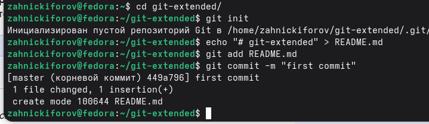
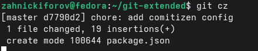
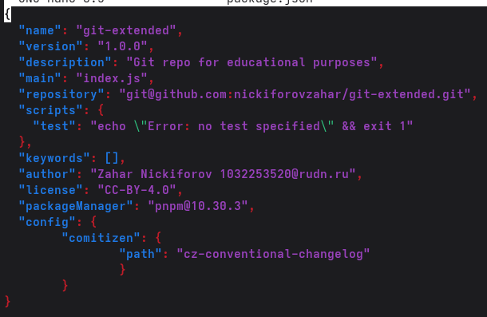
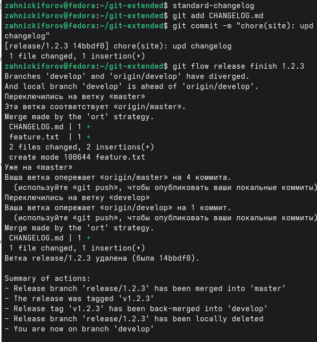

---
## Author
author:
  name: Никифоров Захар Сергеевич
  email: 1032253520@rudn.ru
  affiliation:
    - name: Российский университет дружбы народов
      country: Российская Федерация
      postal-code: 117198
      city: Москва
      address: ул. Миклухо-Маклая, д. 6
## Title
title: Работа с репозиториями Git и GitFlow
subtitle: Лабораторная работа №4
license: CC BY
date: today
date-format: "YYYY-MM-DD" # Example: 2025-09-06
---

# Вводная часть

## Актуальность

- Git --- основной инструмент для управления версиями кода
- GitFlow --- позволяет соблюдать структуру в разработке
- Знание правильной работы с репозиториями

## Объект и предмет исследования

- Объект исследования: процесс работы с репозиториями Git
- Предмет исследования: GitFlow и инструменты работы с репозиториями

## Цели и задачи

Цель: Получение навыков правильной работы с репозиториями git.

Задачи: 
1. Установить необходимое ПО
2. Создать репозиторий git-extended
3. Выполнить его синхронизацию с GitHub
4. Настроить конфигурацию коммитов
5. Ознакомится с системой релизов

## Материалы и методы

- Оборудование: ПК с ОС Linux или ВМ на нем с ОС Linux
- ПО: git, gh, git-flow, node.js, pnpm
- Методы: Установка согласно руководству, работа с ветками, создание релизов.

# Порядок выполнения работы

## Установка программ 

- Устанавливаем pandoc, pandoc-crossref,quarto, LaTex.

{#fig-001 width=70%}

{#fig-002 width=70%}

## Создание Git-репозитория

- Создаем локальный репозиторий и инициализируем, получаем первый README.md, который уже закомментировали.

{#fig-003 width=70%}

## Настройка commitizen

- Используя утилиту commitizen, делаем коммит с помощью git cz

{#fig-004 width=70%}

## Настройка файла package.json

- Открываем package.json и редактируем его.

{#fig-005 width=70%}

## Инициализация Git Flow и создание ветки feature.

- Инициализируем Git Flow
- Получаем базовые ветки master и develop
- Создаем ветку feature

{#fig-006 width=70%}

## Проверка веток и создание журнала изменений

- По завершении работы с веткой feature, финишируем ее
- Проверяем ветки
- Создаем новый релиз 1.2.3 и завершаем его.

{#fig-007 width=70%}

# Выводы

- Были получены навыки правильной работы с репозиториями git.

