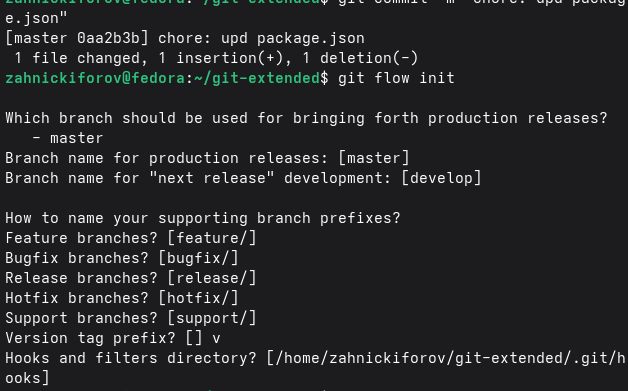
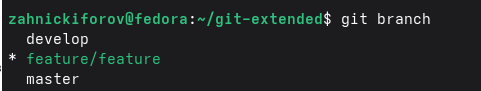

---
author:
  name: Никифоров Захар Сергеевич
  group: НКАбд-05-25
  student-id: 1032253520
title: "Отчет по лабораторной работе №4"
subtitle: "Архитектура компьютера"
license: "CC BY"
---

# **Цель работы**

Получение навыков правильной работы с репозиториями git.

# **Порядок выполнения работы**
## **Проверка установленных инструментов**

Скачиваем *git* и *git*, если они не установлены, а иначе --- просто проверяем их версии. Также устанавливаем *pnpm* *nodejs*.

{#fig-001 width=70%}

{#fig-002 width=70%}

Инструменты успешно установлены.

## **Создание Git-репозитория**

Создаем локальный репозиторий и инициализируем.

{#fig-003 width=70%}

Был создан первый README.md файл, который добавился в репозиторий и был закомментирован.

## **Настройка commitizen**
Для стандартизации сообщений коммитов была использована утилита commitizen. По завершении настройке был выполнен коммит с помощью *git cz*.

{#fig-004 width=70%}

## **Настройка файла package.json**

В файле *package.json* была добавлена конфигурация с информацией о названии проекта, версии, авторе, лиценцзии и прочем.

{#fig-005 width=70%}

## **Инициализация Git-flow**

Для организации процесса разработки была выполнена инициализация Git flow с помощью соответствующей команды. 

{#fig-006 width=70%}

В результате мы получили две ветки, основную --- master и для разработки --- develop. Также были заданы префиксы для служебных веток.

## **Создание ветки feature**

Для разработики новой функциональности была создана ветка типа feature. После создания проверим ее наличие.

{#fig-007 width=70%}

Ветка была успешно создана, также можем увидеть основную и для разработки.

## **Проверка веток репозитория**

После выполнения операций была выполнена дополнительная проверка текущих веток проекта.

{#fig-008 width=70%}

Как результат, проверка успешна *feature_branch* на месте.

## **Формирование журнала изменений**

Далее для генерации журнала изменений и завершения релиза прописываем:

{#fig-009 width=70%}

Мы завершили ветку release с помощью команды *git flow release finish 1.2.3 *, изменения же были объединены с веткой master, релиз пометился тегом v1.2.3, изменения же были объединены обратно в develop, а ветка release удалена.

# **Выводы**

Были получены навыки правильной работы с репозиториями git.

::: {#refs}
:::
