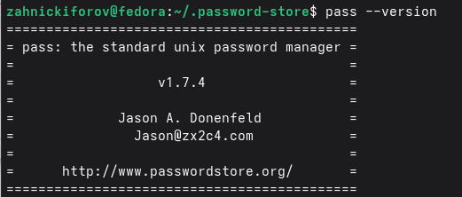
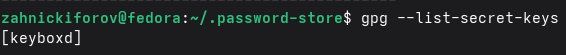
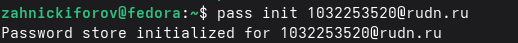
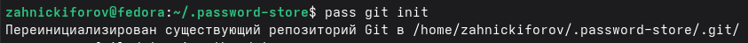
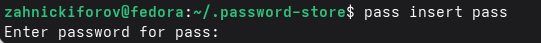
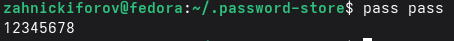

---
## Author
author:
  name: Никифоров Захар Сергеевич
  email: 1032253520@rudn.ru
  affiliation:
    - name: Российский университет дружбы народов
      country: Российская Федерация
      postal-code: 117198
      city: Москва
      address: ул. Миклухо-Маклая, д. 6
## Title
title: Менеджер паролей pass
subtitle: Лабораторная работа №5
license: CC BY
date: today
date-format: "YYYY-MM-DD" # Example: 2025-09-06
---

# Вводная часть

## Актуальность

- Современные пользователи используют много аккаунтов
- Безопасное хранение паролей очень важно
- Менеджеры паролей позволяют централизировать хранение данных

## Объект и предмет исследования

- Объект исследования: менеджеры паролей в ОС Linux.
- Предмет исследования: менеджер паролей pass.

## Цели и задачи

Цель: Изучить работу менеджера паролей *pass*, научиться хранить зашифрованные пароли и синхронизировать хранилище с использованием GitHub. 

Задачи: 
1. Установить менеджер паролей pass.
2. Инициализировать хранилище данных.
3. Добавить запись в базу паролей.
4. Настроить синхронизацию через Git.

## Материалы и методы

- Оборудование: ПК с ОС на базе Linux или ВМ на нем с такой системой
- ПО: Git, pass, GnuPG
- Методы: Установка согласно руководству, настройка через терминал, шифрование паролей.

# Выполнение лабораторной работы

## Установка менеджера паролей 

- Установлен менеджер паролей pass.

{#fig-001 width=70%}

## Проверка GPG ключей в системе

- Проверяем наличие GPG ключа в системе

{#fig-002 width=70%}

## Инициализация хранилища паролей

- Инициализируем хранилище паролей с использованием нашего GPG ключа.

{#fig-003 width=70%}

## Синхронизация с Git

- Для отслеживания изменений инициализировали git-репозиторий.

{#fig-004 width=70%}

## Добавление нового пароля

- Добавляем новую запись в базу паролей. 

{#fig-005 width=70%}

## Просмотр сохраненного пароля

- Проверяем, что пароль успешно сохранен.

{#fig-006 width=70%}

# Выводы

- Изучен менеджер паролей pass
- Создано хранилище паролей
- Добавлены записи в базу
- Настроена синхронизация через Git.
