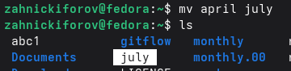
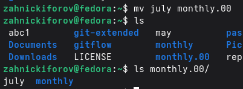
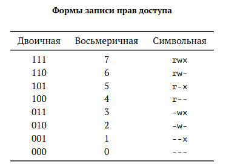

---
## Author
author:
  name: Никифоров Захар Сергеевич
  email: 1032253520@rudn.ru
  affiliation:
    - name: Российский университет дружбы народов
      country: Российская Федерация
      postal-code: 117198
      city: Москва
      address: ул. Миклухо-Маклая, д. 6
## Title
title: Анализ файловой системы Linux. Команды для работы с файлами и каталогами
subtitle: Лабораторная работа №7
license: CC BY
date: today
date-format: "YYYY-MM-DD" # Example: 2025-09-06
---

# Вводная часть

## Актуальность

- Файловые системы --- основа хранения и организации данных в ОС, от них зависит стабильность всей системы
- Понимание принципов работы файловых систем и прав доступа необходимы для ИТ специалиста
- Для предотвращения повреждения файловых систем нужно уметь с ними работать.

## Объект и предмет исследования

- Объект исследования: Файловая система ОС
- Предмет исследования: Операции управления файлами и каталогами, права доступа и команды работы с файловой системой Linux

## Цели и задачи

Цель: Изучить структуру файловой системы Linux, основные операции с файлами и каталогами, а также механизмы управления правами доступа.

Задачи: 
1. Изучить структуру файловой системы Linux
2. Освоить основные команды работы с файлами и каталогами
3. Изучить механизм прав доступа и команду chmod
4. Выполнить операции копирования, перемещения и изменения прав
5. Ознакомиться с командами администрирования файловых систем

## Материалы и методы

- Оборудование: ПК с ОС на базе Linux или ВМ на нем с такой системой
- ПО: Fedora WorkStation
- Методы: Знакомство согласно руководству, опыты, изучение документации.

# Выполнение лабораторной работы

## **Копирование файлов и каталогов**

Для копирования файлов и каталогов используется команда cp.
Возможности:

- Копировать файлы/каталоги
- Присваивать новые имена при копировании
- Работать в текущем и произвольном каталоге

---

Пример использования:

{#fig-001 width=70%}

---

## **Перемещение и переименование файлов и каталогов**

Для перемещения файлов/каталогов используются команды mv/mvdir.
Их возможности:
- Перемещать файлы/каталоги
- Присваивать новые имена при перемещении
- Переименовывать файлы/каталоги

---

Пример использования:

{#fig-002 width=70%}

{#fig-003 width=70%}

---

## **Права доступа**

Каждый файл и каталог имеет права доступа, причем они могут быть разными для владельца, членов группы и остальных пользователей. Характеризуются они через сокращения: r --- чтение, w --- запись, x --- выполнение. Изменение предусмотрено с помощью команды chmod. Также есть символьное представление:

{#fig-004 width=70%}

---

Пример использования:

{#fig-005 width=70%}

---

## **Анализ файловой системы**

Файловая система в Linux состоит из файлов и каталогов. Они различаются по надежности, скорости и правам доступа и выбираются в зависимости от задач. Файловая система определяет как данные хранятся на диске, как организована структура каталогов, как обеспечивается доступ и безопасность данных. 

# **Выводы**

- Мы ознакомились с файловой системой Linux, её структурой, именами и содержанием
каталогов. 
- Были приобретены практические навыки по применению команд для работы
с файлами и каталогами, по управлению процессами (и работами), по проверке использования диска и обслуживанию файловой системы.
