---
author:
  name: Никифоров Захар Сергеевич
  group: НКАбд-05-25
  student-id: 1032253520
title: "Отчет по лабораторной работе №7"
subtitle: "Архитектура компьютера"
license: "CC BY"
---

# **Цель работы**

Ознакомление с файловой системой Linux, её структурой, именами и содержанием
каталогов. Приобретение практических навыков по применению команд для работы
с файлами и каталогами, по управлению процессами (и работами), по проверке использования диска и обслуживанию файловой системы.

# **Порядок выполнения работы**

## **Копирование файлов и каталогов**

Копируем файл в текущем каталоге. Скопируем файл ~/abc1 в файл april
и в файл may.

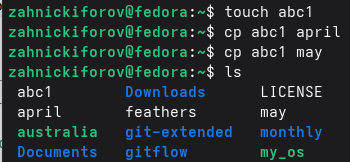{#fig-001 width=70%}

Копируем несколько файлов в каталог. Скопируем файлы april и may в каталог
monthly.

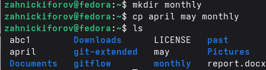{#fig-002 width=70%}

Копируем файл в произвольном каталоге. Скопируем файл monthly/may в файл
с именем june.

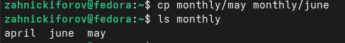{#fig-003 width=70%}

Копируем каталоги в текущем каталоге. Скопируем каталог monthly в каталог
monthly.00.

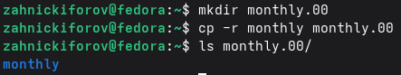{#fig-004 width=70%}

Копируем каталоги в произвольном каталоге. Скопируем каталог monthly.00
в каталог /tmp.

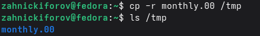{#fig-005 width=70%}

## **Перемещение и переименование файлов и каталогов**

Переименование файлов в текущем каталоге. Изменим название файла april на
july в домашнем каталоге

{#fig-006 width=70%}

Перемещение файлов в другой каталог. Переместим файл july в каталог monthly.00.

{#fig-007 width=70%}

Переименование каталогов в текущем каталоге. Переименуем каталог monthly.00
в monthly.01.

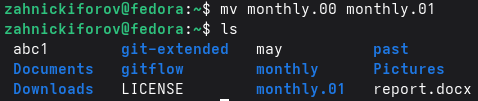{#fig-008 width=70%}

Перемещение каталога в другой каталог. Переместим каталог monthly.01 в каталог
reports.

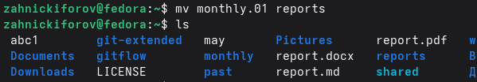{#fig-009 width=70%}

Переименование каталога, не являющегося текущим. Переименуем каталог
reports/monthly.01 в reports/monthly.

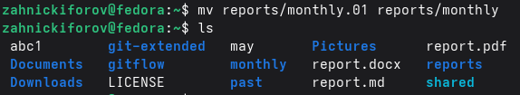{#fig-010 width=70%}

## **Права доступа**

Создадим файл ~/may с правом выполнения для владельца.

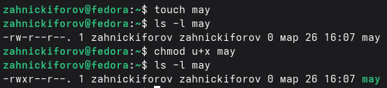{#fig-011 width=70%}

Лишим владельца файла ~/may права на выполнение.

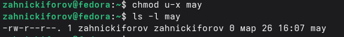{#fig-012 width=70%}

Создание каталога monthly с запретом на чтение для членов группы и всех
остальных пользователей.

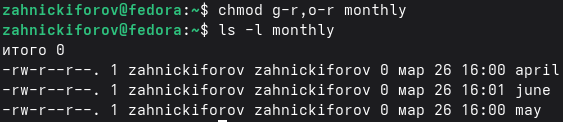{#fig-013 width=70%}

Создание файла ~/abc1 с правом записи для членов группы.

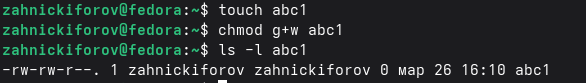{#fig-014 width=70%}

## **Основные опции команд**
    
С помощью команды fsck можно проверим целостность файловой системы.
    
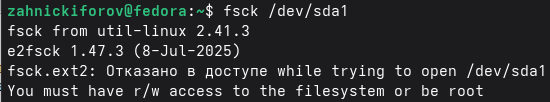{#fig-015 width=70%}

## **Практическая часть**

- Пункт 2:

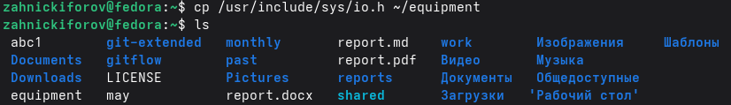{#fig-016 width=70%}

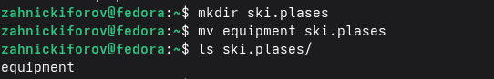{#fig-017 width=70%}

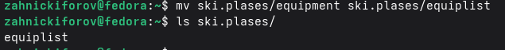{#fig-018 width=70%}

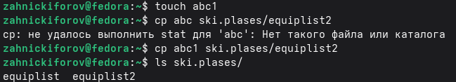{#fig-019 width=70%}

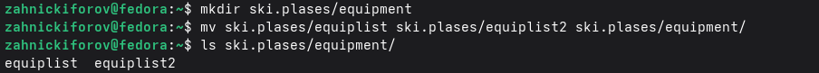{#fig-020 width=70%}

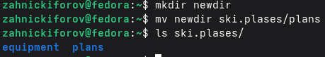{#fig-021 width=70%}

- Пункт 3:

Создадим файлы australia, play, my_os, feathers и зададим им полное отсутствие прав, а потом присвоим нужные.

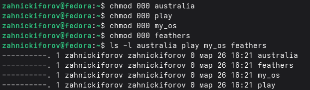{#fig-022 width=70%}

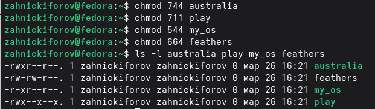{#fig-023 width=70%}

- Пункт 4:

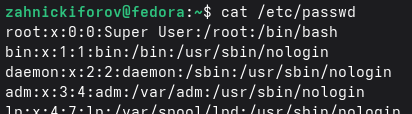{#fig-024 width=70%}

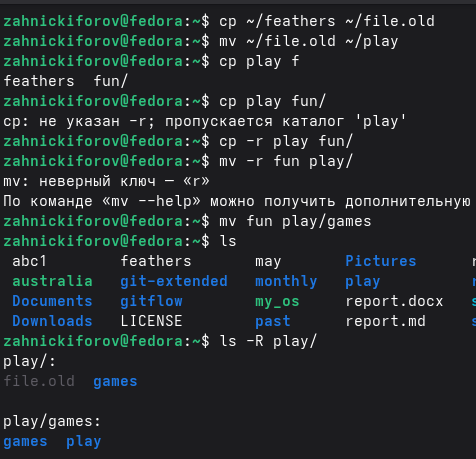{#fig-025 width=70%}

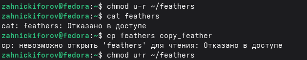{#fig-026 width=70%}

Лишив файл права на чтение, мы теряем возможность копировать его и прочитать содержимое. Вернем это право. 

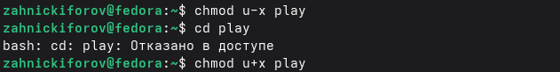{#fig-027 width=70%}

Лишая каталог права на выполнение, мы теряем возможность перейти в него. Вернем это право.

- Пункт 5:
Описание команд:

mount:

- Монтирует файловую систему в древо каталогов. Пример: mount /dev/sdb1 /mnt

fsck:

- Проверяет и восстанавливает файловую систему. Пример: fsck /dev/sdb1

mkfs:

- Создает файловую систему на устройстве. Пример: mkfs.ext4 /dev/sdb1

kill:

- Отправляет сигнал процессу, например, завершение. Пример: kill -9 1234

# **Контрольные вопросы**

1. Файловые системы определяют способ хранения и организации данных на диске. Они различаются по поддержке прав доступа, надежности, размеру файлов и разделов.

2. В Linux всё начинается с корня /. Основные директории: 

- /home --- домашние каталоги пользователей
- /etc --- файлы конфигурации
- /bin, /usr/bin --- программы
- /var --- логи и изменяемые файлы
- /tmp --- временные файлы
- /dev --- устройства
- /proc --- информация о системе процессах

3. Монтирование.

4. Причины: внезапное выключение питания, ошибки диска, сбои системы; решение --- проверка и восстановление через fsck.

5. С помощью команды mkfs.

6. 
- cat --- вывод всего файла
- less/more --- постраничный просмотр
- head --- начало файла
- tail --- конец файла

7. Возможности cp:
- копирование файлов и каталогов
- рекурсивное копирование(-r)
- сохранение прав(-p)
- перезапись файлов(-f)
- интерактивный режим(-i)

# **Выводы**

Ознакомление с файловой системой Linux, её структурой, именами и содержанием
каталогов прошло успешно. Были приобретены практические навыки по применению команд для работы
с файлами и каталогами, по управлению процессами (и работами), по проверке использования диска и обслуживанию файловой системы.

::: {#refs}
:::

