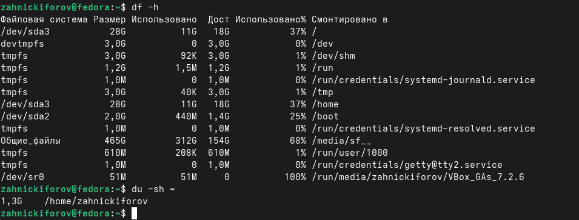

---
## Author
author:
  name: Никифоров Захар Сергеевич
  email: 1032253520@rudn.ru
  affiliation:
    - name: Российский университет дружбы народов
      country: Российская Федерация
      postal-code: 117198
      city: Москва
      address: ул. Миклухо-Маклая, д. 6
## Title
title: Поиск файлов. Перенаправление ввода-вывода. Просмотр запущенных процессов
subtitle: Лабораторная работа №8
license: CC BY
date: today
date-format: "YYYY-MM-DD" # Example: 2025-09-06
---

# Вводная часть

## Актуальность

- ОС требуют навыки эффективной работы с файловой системой и процессами
- Владение инструментами командной строки позволяют автоматизировать задачи, что повышает производительность работы.
## Объект и предмет исследования

- Объект исследования: ОС Linux
- Предмет исследования: инструмент работы с файлами, потоками ввода-вывода и процессами.

## Цели и задачи

Цель: Ознакомление с инструментами поиска файлов и фильтрации текстовых данных. Приобретение практических навыков: по управлению процессами (и заданиями), по проверке использования диска и обслуживанию файловых систем.

Задачи: 
1. Изучить перенаправление ввода-вывода
2. Изучить поиск файлов
3. Изучить управление процессами

## Материалы и методы

- Оборудование: ПК с ОС на базе Linux или ВМ на нем с такой системой
- ПО: Fedora WorkStation
- Методы: Знакомство согласно руководству, опыты, изучение документации.

# Выполнение лабораторной работы

## **Потоки ввода-вывода**

- stdin --- ввод с клавиатуры
- stdout --- вывод в терминал
- stderr --- ошибки

## **Конвейеры**

- Команда1 | Команда2

## **Поиск файлов**

- find ~ -name "*.txt"

## **Фильтрация текста**

- grep "строка" файл

## **Управление процессами**

{#fig-001 width=70%}

## **Работа с диском**

{#fig-002 width=70%}

# **Выводы**

- В ходе работы были получены практические навыки работы с файловой системой и процессами Linux
