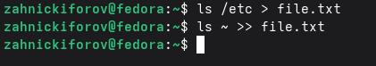
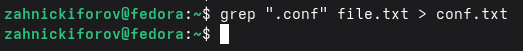
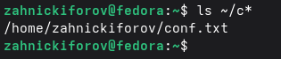
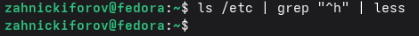
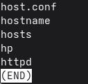
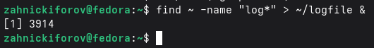
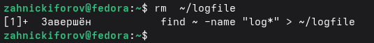
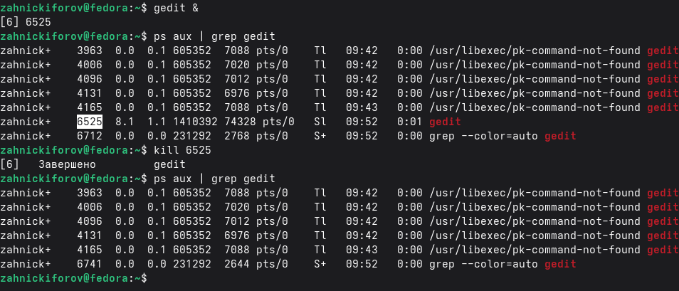
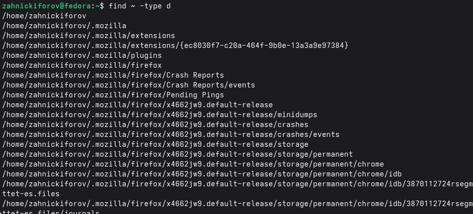

---
author:
  name: Никифоров Захар Сергеевич
  group: НКАбд-05-25
  student-id: 1032253520
title: "Отчет по лабораторной работе №8"
subtitle: "Архитектура компьютера"
license: "CC BY"
---

# **Цель работы**

Ознакомление с инструментами поиска файлов и фильтрации текстовых данных. Приобретение практических навыков: по управлению процессами (и заданиями), по проверке использования диска и обслуживанию файловых систем.

# **Порядок выполнения работы**
## **Перенаправление вывода в файл**

Были использованы команды:

{#fig-001 width=70%}

Результат: создан файл со списком файлов каталога /etc, и данные были добавлены без перезаписи.

## **Фильтрация данных**

Команда:

{#fig-002 width=70%}

Результат: в файл conf.txt записаны только файлы с расширением .conf

## **Поиск файлов**

Используем команды:

{#fig-003 width=70%}

{#fig-004 width=70%}

Результат: найдены файлы, начинающиеся с буквы 'c'.

## **Постраничный вывод**
Используем команду:

{#fig-005 width=70%}

{#fig-006 width=70%}

Результат: список файлов отобразился постранично

## **Работа с фоновыми процессами и управление ими**

Запуск процесса:

{#fig-007 width=70%}

Завершим его:

{#fig-008 width=70%}

Запустим другой процесс а после завершим его через PID.

{#fig-009 width=70%}

Процесс завершился.

## **Проверка диска**

Используем команду:

{#fig-010 width=70%}

Результат: мы получили информацию о свободном месте и размере каталога.

## **Поиск директорий**

Выполним команду:

{#fig-011 width=70%}

Результат: получили на вывод кучу директорий

# **Контрольные вопросы**

1. 
- stdin(0) --- ввод с клавиатуры
- stdout(1) --- вывод в консоль
- stderr(2) --- ошибки

2. '>' --- перезаписывает файл, '>>' --- дописывает в конец файла

3. Это передача вывода одной команды в другую.

4. Программа --- файл с кодом, а процесс --- выполнение программы.

5. PID --- идентификатор процесса, GID --- идентификатор группы пользователей.

6. Это процессы, запущенные в фоне. Команда 'jobs'

7. top --- показывает процессы в реальном времени, htop --- версия с более удобным интерфейсом. 

8. Команда find. Пример: find ~ -name "*.txt"

9. Можно, например: grep "что-то" файл 

10. Командой: df -h

11. Командой: du -sh ~

12. Командой: kill PID

# **Выводы**

Ознакомление с инструментами поиска файлов и фильтрации текстовых данных прошло успешно. Были приобретены практические навыки: по управлению процессами (и заданиями), по проверке использования диска и обслуживанию файловых систем.

::: {#refs}
:::

