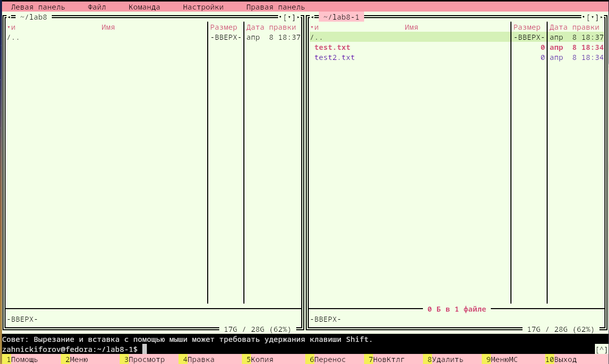
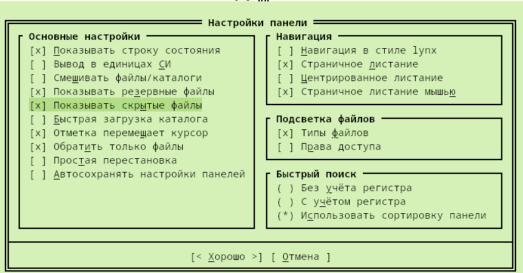

---
## Author
author:
  name: Никифоров Захар Сергеевич
  email: 1032253520@rudn.ru
  affiliation:
    - name: Российский университет дружбы народов
      country: Российская Федерация
      postal-code: 117198
      city: Москва
      address: ул. Миклухо-Маклая, д. 6
## Title
title: Командная оболочка Midnight Commander
subtitle: Лабораторная работа №9
license: CC BY
date: today
date-format: "YYYY-MM-DD" # Example: 2025-09-06
---

# Вводная часть

## Актуальность

- Работа в терминале является ключевым навыком в Linux-системах
- Midnight Commander упрощает выполнение типовых операций с файлами
- Оптимизирует работу с файловой системой

## Объект и предмет исследования

- Объект исследования: ОС Linux
- Предмет исследования: инструмент работы с файлами Midnight Commander.

## Цели и задачи

Цель: Освоение основных возможностей командной оболочки Midnight Commander. Приобретение навыков практической работы по просмотру каталогов и файлов; манипуляций
с ними

Задачи: 
1. Изучить структуру интерфейса mc
2. Освоить основные операции с файлами 
3. Освоить встроенный текстовый редактор
4. Изучить настройки и их влияние на работу
5. Изучить работу с панелями и меню

## Материалы и методы

- Оборудование: ПК с ОС на базе Linux или ВМ на нем с такой системой
- ПО: Fedora WorkStation
- Методы: Знакомство согласно руководству, опыты, изучение документации.

# Выполнение лабораторной работы

## **Что такое Midnight Commander**

- Псевдографическая оболочка для UNIX/Linux
- Работает в терминале
- Упрощает работу с файлами
- Альтернатива shell-командам

## **Интерфейс mc**

- Две панели файлов
- Меню (F9)
- Командная строка
- Функциональные клавиши (F1-F10)

{#fig-001 width=30%}

## **Основные операции**

- Просмотр файлов (F3)
- Редактирование (F4)
- Копирование (F5)
- Перемещение (F6)
- Создание каталогов (F7)
- Удаление (F8)

## **Работа с панелями**

- Навигация по каталогам
- Смена активной панели
- Сравнение каталогов
- Сортировка файлов
- Разные режимы отображения

## **Меню mc**

- Файл --- операции с файлами
- Команда --- системные действия
- Настройки --- конфигурация
- Панели --- отображение

## **Настройки mc**

- Отображение скрытых файлов
- Изменение интерфейса
- Настройка поведения программы

{#fig-002 width=50%}

## **Поиск и команды**

- Поиск файлов по параматрам
- История команд
- Быстрый переход по каталогам

## **Встроенный редактор**

- Открывается через F4
- Поддерживает:
1. редактирование текста
2. поиск и замену
3. выделение и копирование
4. горячие клавиши

# **Выводы**

- mc упрощает работу с файловой системой
- заменяет многие команды shell
- удобен для быстрого управления файлами
- особенно полезен в терминале

