---
author:
  name: Никифоров Захар Сергеевич
  group: НКАбд-05-25
  student-id: 1032253520
title: "Отчет по лабораторной работе №9"
subtitle: "Архитектура компьютера"
license: "CC BY"
---

# **Цель работы**

Освоение основных возможностей командной оболочки Midnight Commander. Приобретение навыков практической работы по просмотру каталогов и файлов; манипуляций с ними.

# **Порядок выполнения работы**
## **Задание по mc**
1. С помощью команды man mc вызываем документацию по программе и изучаем.

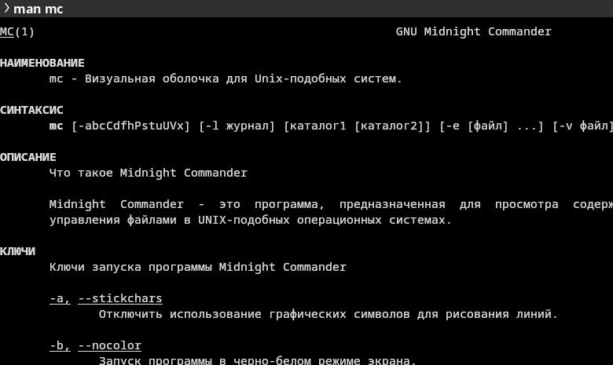{#fig-001 width=70%}

2. Запускаем *mc* и выделяем файл test.txt

{#fig-002 width=70%}

3. Снимаем выделение с файла. Копируем и перемещаем файл test2.txt, смотрим информацию о нем, его правах доступа. Размер файла можно увидеть при выделении или просмотра информации о конкретном файле.

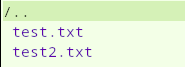{#fig-003 width=70%}

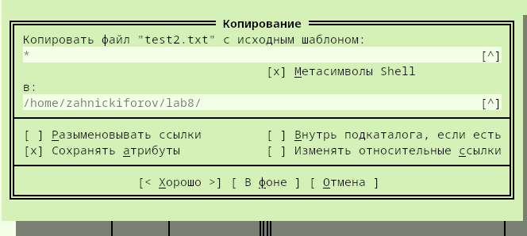{#fig-004 width=70%}

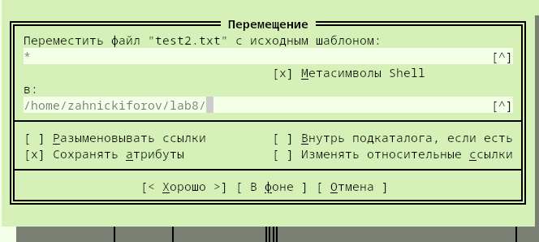{#fig-005 width=70%}

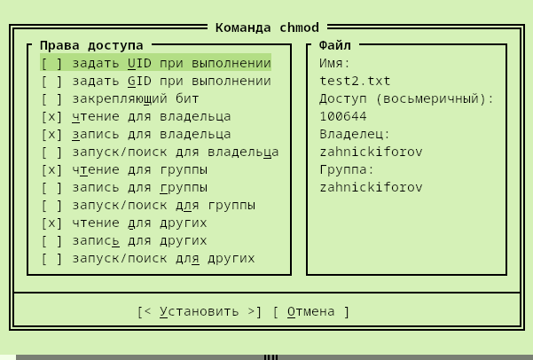{#fig-006 width=70%}

4. С помощью вкладки левой панели мы смотрим информацию о файле, меняем вид обзора файлов, параметр сортировки

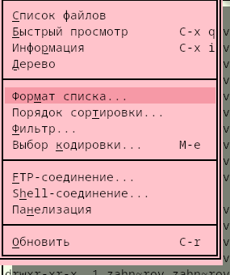{#fig-007 width=70%}

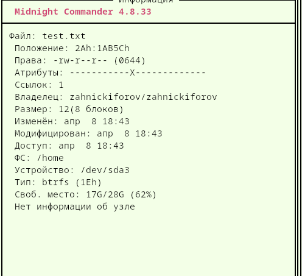{#fig-008 width=70%}

5. Открываем подменю *Файл*. Просматриваем содержимое файла test.txt, записываем в файл test2.txt, выходим, не сохраняя. Создаем каталог, копируем файл в него.

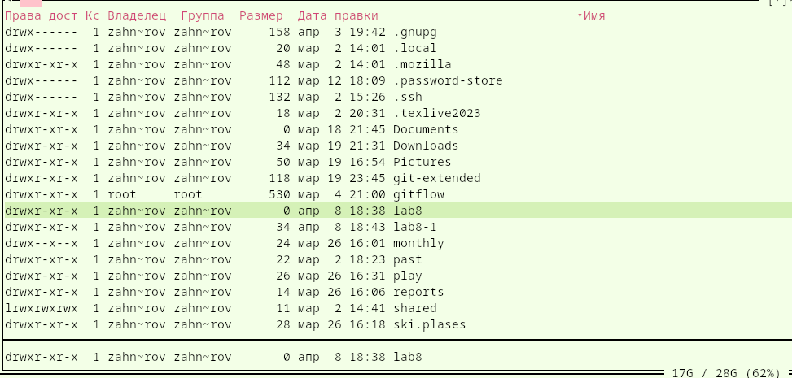{#fig-009 width=70%}

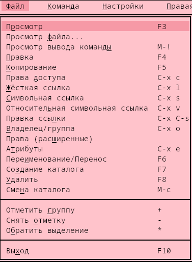{#fig-010 width=70%}

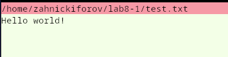{#fig-011 width=70%}

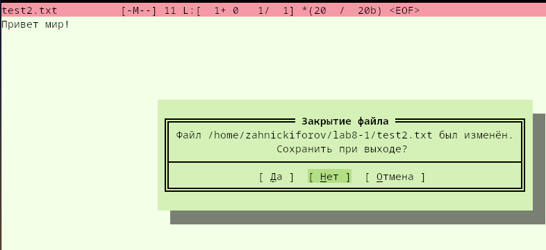{#fig-012 width=70%}

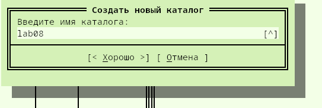{#fig-014 width=70%}

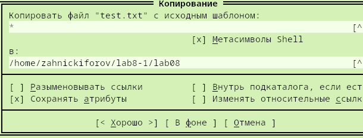{#fig-015 width=70%}

6. Выполняем поиск файла с расширением .cpp содержащий слово main. Выполняем просмотр истории команд и выполняем её. Переходим в домашний каталог и знакомимся с файлами меню и расширений.

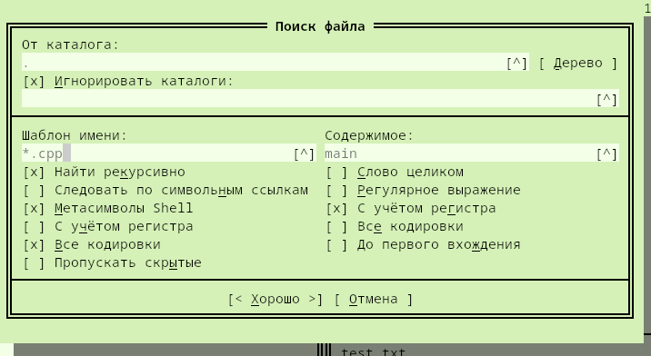{#fig-016 width=70%}

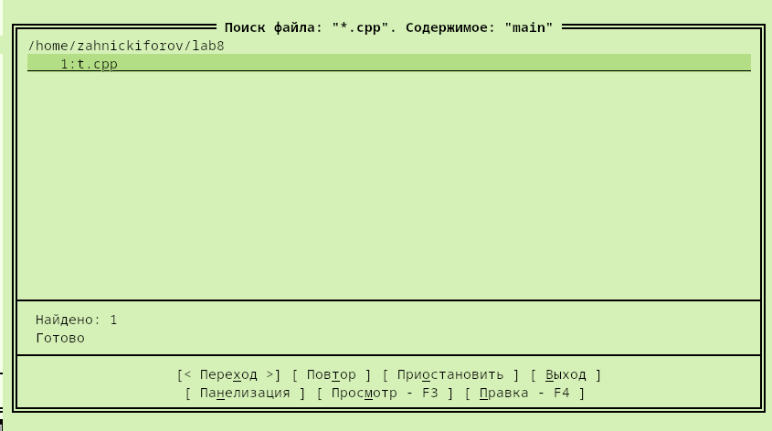{#fig-017 width=70%}

{#fig-018 width=70%}

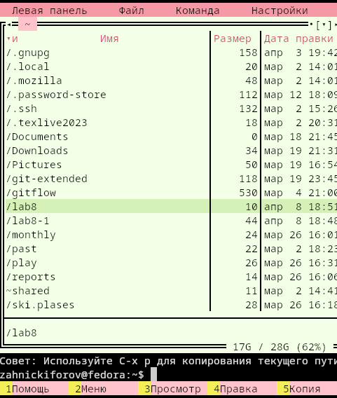{#fig-019 width=70%}

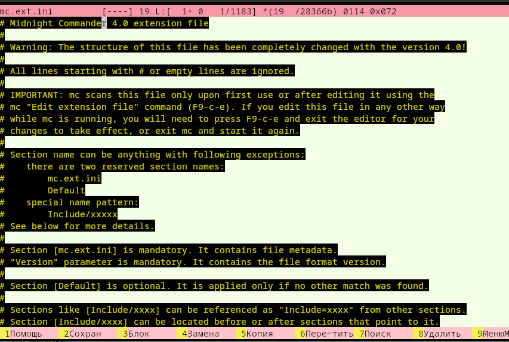{#fig-020 width=70%}

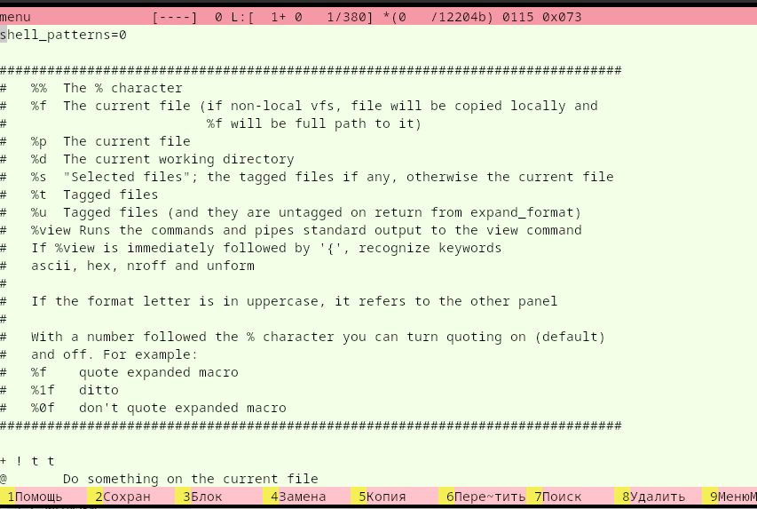{#fig-021 width=70%}

7. Вызываем подменю Настройки. Включаем/выключаем показ скрытых файлов.

{#fig-022 width=70%}

## **Задание по встроенному редактору mc**

1. Создаем файл test.txt.

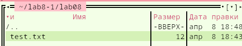{#fig-023 width=70%}

2. Открываем этот файл внутри mc.

3. Вставляем текст из интернета.

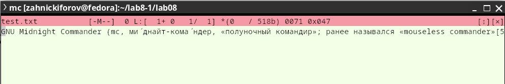{#fig-024 width=70%}

4. Удалим строку сочетанием клавиш 'ctrl+y', вернем и выделим фрагмент, а затем перенесем на новую строку, скопируем, сохраним файл, отменим последние действия. Перейдем в конец/начало файла с помощью 'ctrl+end/home'. Сохраним и закроем файл.

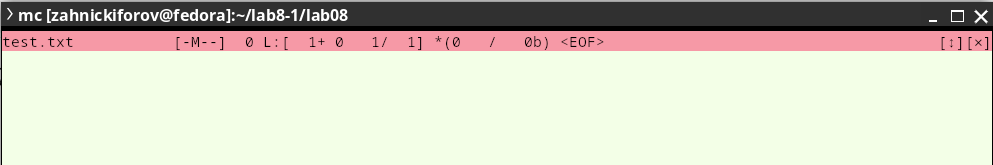{#fig-025 width=70%}

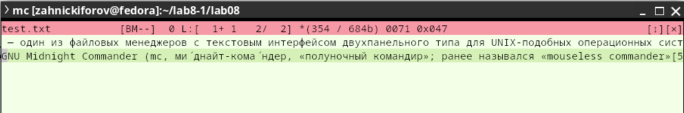{#fig-026 width=70%}

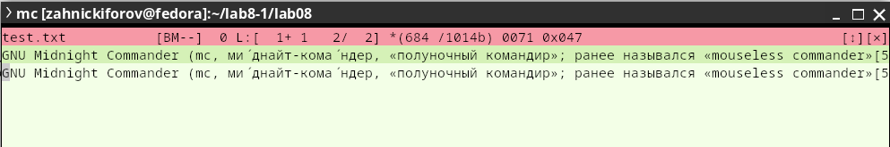{#fig-027 width=70%}

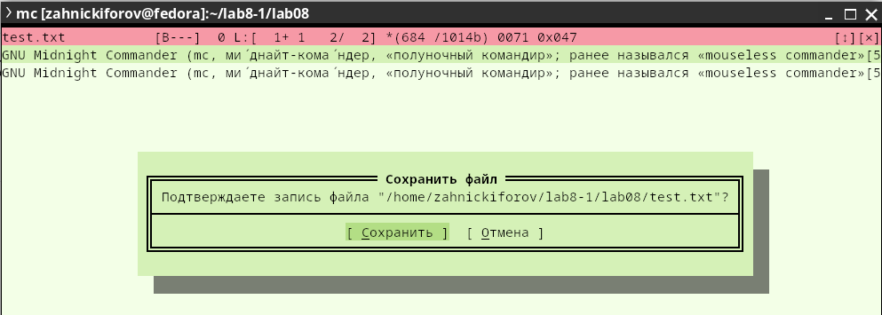{#fig-028 width=70%}

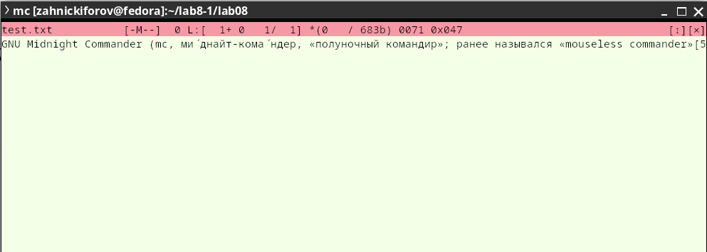{#fig-029 width=70%}

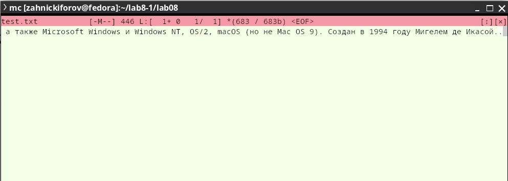{#fig-030 width=70%}

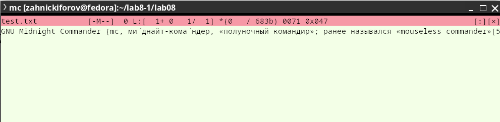{#fig-031 width=70%}

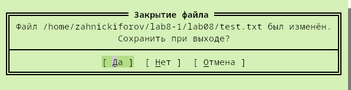{#fig-032 width=70%}

5. Откроем файл на языке С++.

6. Так как подсветка синтаксиса была включена, уберем её, выбрав в меню подсветки unknown.

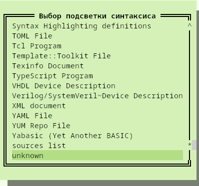{#fig-033 width=70%}

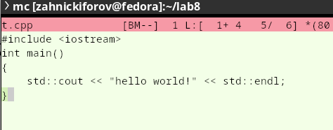{#fig-034 width=70%}

# **Контрольные вопросы**

1. В mc основой интерфейса являются панели, которые могут быть в разных режимах отображения: список файлов текущего каталога, информация о файле и файловой системе, дерево каталогов, а также быстрый просмотр, который выводит содержимое файла.

2. Примеры: копирование --- F5, перемещение --- F6 , удаление --- F8 , создание каталога --- F7, просмотр файла --- F3, редактирование --- F4. 

3. Меню левой/правой панели предназначены для управления отображением содержимого. Через них можно включать быстрый просмотр, режим информации, выбирать форматы списка, порядок сортировки.

4. Меню Файл содержит команды, которые применяются к выбранным файлам. Например, просмотр, редактирование, копирование, изменение прав доступа, создание жесткой/символической ссылки, смена владельца и группы, переименование, перемещение, создание каталога, удаление и выход. Это команды непосредственной работы с файлами.

5. Меню Команда включает общие команды управления mc. В него входят дерево каталогов, поиск файла, перестановка панелей, просмотр размера каталогов, история командной строки, каталоги быстрого доступа, восстановление файлов, редактирование файла расширений/меню и файла расцветки имён. Это более общие действия оболочки.

6. Меню Настройки предназначено для конфигурации внешнего вида и поведения оболочки. Оно включает конфигурацию внешнего вида, настройки панелей, биты символов, подтверждение действий, распознание клавиш и параметры виртуальных файловых систем. Благодаря этому меню можно настроить вид оболочки под себя, меняя цветовую схему, подтверждения на удаление, показ скрытых файлов и другие параметры. 

7. F1 --- помощь, F2 --- пользовательское меню, F3 --- просмотр файла, F4 --- редактирование файла, F5 --- копирование, F6 --- перемещение, F7 --- создание каталога, F8 --- удаление, F9 --- вызов меню, F10 --- выход. Также есть различные комбинации, например, ctrl+u для перестановки панелей.

8. ctrl+y --- удаление строки, ctrl+u --- отмена последнего действия, Ins --- вставка/замена, F7 --- поиск, Shift+F7 --- повтор поиска, F4 --- замена, F3 --- начало и конец выделения, F5 --- копировать выделенное, F6 --- перемещение выделенного, F8 --- удаление выделенного, F2 --- сохранение файла, F10 --- выход. Это удобные команды для базового редактирования текста внутри mc.

9. Для пользовательских меню в mc используется команда 'Редактировать файл меню', а также вызовом пользовательского меню клавишей F2. Это позволяет настраивать собственные пункты меню и добавлять пользовательские действия, которых не было.

10. Для задания пользовательских действий над файлами используется файл расширений через команду 'Редактировать файл расширений'. Мы можем настроить, какие действия выполнять для файлов определенных расширений. Например, можно определить, какой программой открывать .docx или другие типы.

# **Выводы**

Были освоены основные возможности командной оболочки Midnight Commander. Приобретены навыки практической работы по просмотру каталогов и файлов; манипуляций с ними.

::: {#refs}
:::

